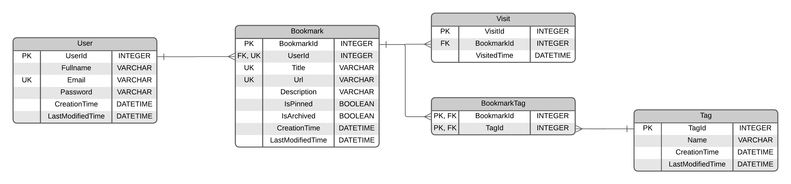

# Bookmark Manager Application
[](https://github.com/dksifoua/bookmark-manager-app/actions/workflows/deployment.yaml)


Fully functional bookmark manager with creation, edit, archive, search, and filter features.

## Features

Users are able to:

- Add new bookmarks with a title, description, website URL, and tags
- View all their bookmarks
- See bookmark details, including favicon, title, URL, description, tags, view count, last visited date, and date added
- Search for bookmarks by title in the search bar
- Filter bookmarks by selecting one or multiple tags from the sidebar
- Reset tag filters to view all bookmarks again
- View archived bookmarks
- Archive bookmarks to remove them from the main view without deleting them
- Pin/unpin bookmarks to keep important ones easily accessible
- Edit existing bookmarks to update their details
- Copy bookmark URLs to the clipboard
- Visit bookmarked websites directly from the app
- Sort bookmarks by "Recently added," "Recently visited," or "Most visited"
- Toggle between light and dark color themes
- View the optimal layout for the interface depending on their device's screen size

## Local Installation

```bash
docker compose build --no-cache && docker compose up
```

## Database diagram



## Launch the application locally

## Tech Stack

## Author

- [@dksifoua](https://www.github.com/dksifoua)
